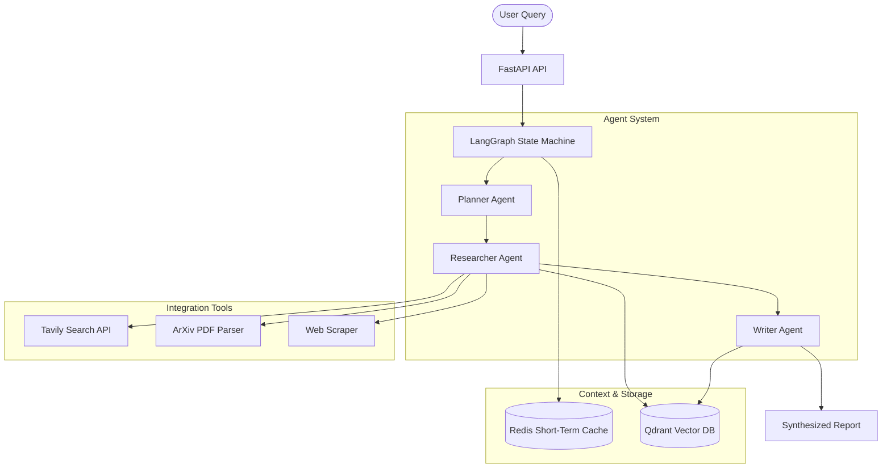

# Autonomous Research Agent

An autonomous research system built with LangGraph, FastAPI, Redis, and Qdrant. It breaks down complex queries, fetches web/academic resources (using Tavily and ArXiv APIs), stores context in short-term/long-term memory, and synthesizes reports with complete citations and confidence scores.

## Architecture



## Folder Structure

```
research-agent/
├── agents/            # Core agent reasoning logic (Planner, Researcher, Writer)
├── tools/             # Search, scraping, and document retrieval utilities
├── memory/            # State caching (Redis) and vector search (Qdrant)
├── graph/             # LangGraph state machine definition
├── output/            # Formatting and citation verification
├── api/               # FastAPI endpoints (/research, /status, /report)
├── observability/     # OpenTelemetry, LangSmith, and Prometheus metrics
├── tests/             # Unit and integration test suites
└── deploy/            # Docker and Prometheus configurations
```

## Getting Started

1. Copy `.env.example` to `.env` and fill in API keys:
   ```bash
   cp .env.example .env
   ```

2. Start the services using Docker Compose:
   ```bash
   docker compose -f deploy/docker-compose.yml up --build
   ```

3. Trigger a research task:
   ```bash
   curl -X POST http://localhost:8000/api/v1/research \
     -H "Content-Type: application/json" \
     -d '{"query": "Room temperature superconductivity developments in 2026"}'
   ```
