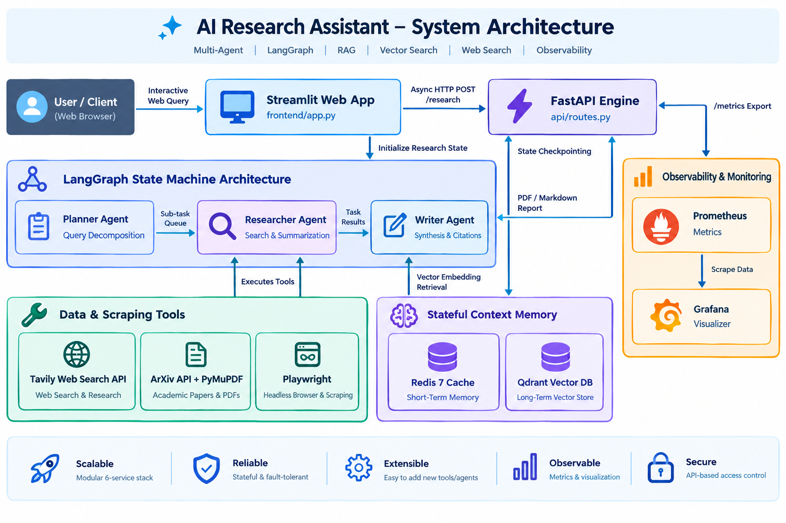

# Autonomous Research Agent

[](https://github.com/your-username/research-agent/actions)

An autonomous multi-agent research system built with LangGraph, FastAPI, Redis, Qdrant, Prometheus, Grafana, and Streamlit. It breaks down complex queries, fetches web/academic resources (using Tavily and ArXiv APIs), stores context in short-term/long-term memory, and synthesizes publication-quality reports with complete citations and confidence scores.

## Architecture



```
research-agent/
├── agents/            # Core agent reasoning logic (Planner, Researcher, Writer)
├── api/               # FastAPI endpoints (/research, /status, /report, /metrics)
├── frontend/          # Streamlit UI web application (app.py)
├── graph/             # LangGraph state machine definition
├── memory/            # State caching (Redis) and vector search (Qdrant)
├── output/            # Formatting (Markdown/PDF) and citation confidence scorer
├── observability/     # OpenTelemetry, LangSmith, and Prometheus metrics
├── deploy/            # Docker, Compose, Prometheus, and Grafana provisioning
├── tests/             # Unit and integration test suites
├── scripts/           # Local execution scripts
├── .github/workflows/ # GitHub Actions CI/CD configuration
├── railway.json       # Railway.app deployment specification
└── pyproject.toml     # Poetry dependency declaration
```

## Quick Start (Docker Compose Stack)

Bring up the complete 6-service stack (API, Redis, Qdrant, Prometheus, Grafana, Streamlit):

```bash
# 1. Copy environment template and fill in API keys
cp .env.example .env

# 2. Launch all services using Docker Compose
docker compose -f deploy/docker-compose.yml up --build -d
```

### Access Points:
- **Streamlit Web UI**: [http://localhost:8501](http://localhost:8501)
- **FastAPI API Docs**: [http://localhost:8000/docs](http://localhost:8000/docs)
- **Prometheus Metrics**: [http://localhost:9090](http://localhost:9090)
- **Grafana Dashboard**: [http://localhost:3000](http://localhost:3000) (Credentials: `admin`/`admin`)
- **Qdrant Dashboard**: [http://localhost:6333/dashboard](http://localhost:6333/dashboard)

---

## Local Development & Testing

1. Run the local startup helper:
   ```bash
   chmod +x scripts/run-local.sh
   ./scripts/run-local.sh
   ```

2. Run the test suite:
   ```bash
   venv/bin/pytest tests/
   ```

3. Run Ruff code styling and formatting checks:
   ```bash
   venv/bin/ruff check .
   venv/bin/ruff format --check .
   ```

---

## API Endpoints

- `POST /api/v1/research`: Trigger a background research workflow task.
  ```json
  {
    "query": "Recent breakthroughs in room temperature superconductivity"
  }
  ```
- `GET /api/v1/status/{task_id}`: Retrieve task processing status (`queued`, `running`, `completed`, `failed`).
- `GET /api/v1/report/{task_id}`: Retrieve the synthesized report and references.
- `GET /metrics`: Prometheus metrics scrape endpoint.
- `GET /`: Health check endpoint.

---

## Deployment (Railway.app)

Deploying to [Railway](https://railway.app):

1. Link your GitHub repository in Railway.
2. Railway automatically detects `railway.json` and builds via `deploy/Dockerfile`.
3. Add environment variables in the Railway dashboard (`OPENAI_API_KEY`, `TAVILY_API_KEY`).
4. Attach Redis and Qdrant database plugins in your Railway project canvas.
